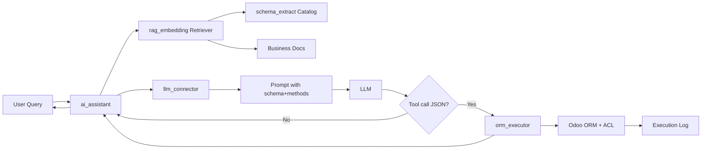
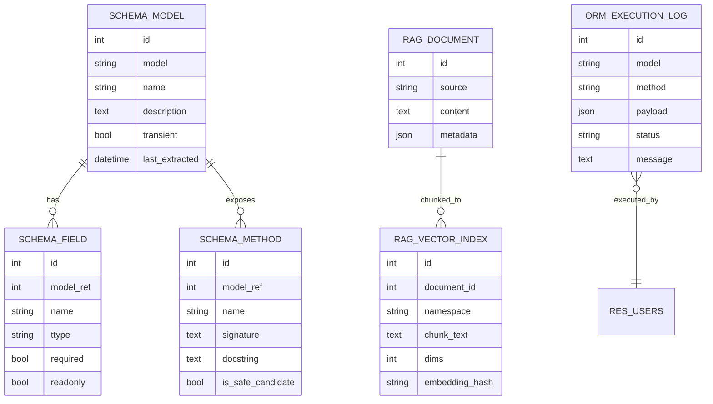
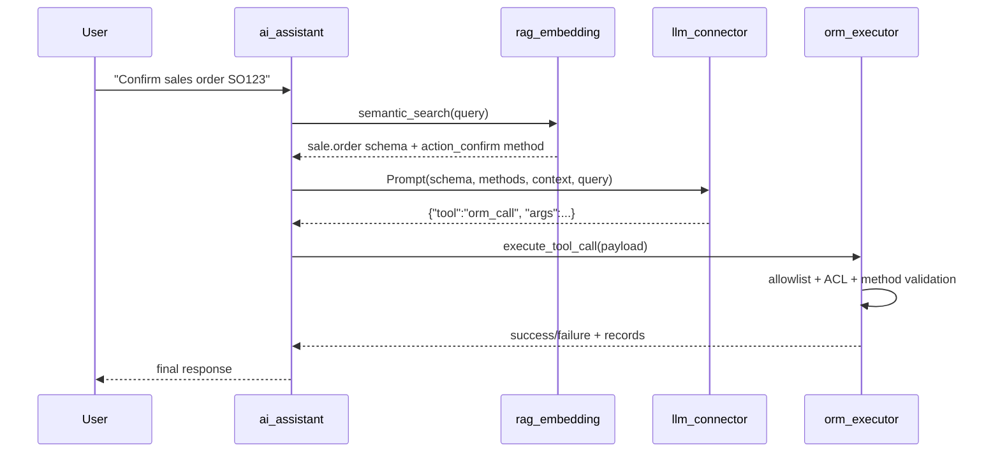

# AskOdoo - AI-Powered Odoo Database Assistant

AskOdoo is a modular Odoo addon collection that combines Retrieval-Augmented Generation (RAG), multi-provider LLM integration, and a safe ORM execution engine.

## Project Structure

```text
addons/
  schema_extract/   # model/field/method extraction and metadata catalog
  rag_embedding/    # pgvector-backed embeddings and semantic retrieval
  llm_connector/    # OpenAI/Gemini/Ollama providers + prompt orchestration
  orm_executor/     # allowlisted and ACL-aware ORM tool execution
  ai_assistant/     # chat orchestration, API controller, and CLI
```

## Architecture Overview



## Database Diagram



## Sequence Flow (RAG + ORM Execution)



## Installation

1. Install dependencies:
   ```bash
   pip install -r requirements.txt
   ```
2. Ensure PostgreSQL has pgvector extension available.
3. Add this repository's `addons` directory to your Odoo `addons_path`.
4. Install modules in this order:
   - `llm_connector`
   - `schema_extract`
   - `rag_embedding`
   - `orm_executor`
   - `ai_assistant`

## Configuration

- Configure one or more LLM backends in **Settings → Technical → AskOdoo → LLM Backends**.
- Mark one backend as default.
- Run schema extraction once after installing modules.

## CLI and Operational Commands

### Extract schema and methods
```bash
odoo-bin shell -d <db> -c <odoo.conf> -c "env['schema.catalog.service'].refresh_schema_catalog()"
```

### Build embeddings from schema and documents
```bash
odoo-bin shell -d <db> -c <odoo.conf> -c "env['rag.embedding.service'].rebuild_embeddings()"
```

### Run AskOdoo assistant from CLI
```bash
python addons/ai_assistant/tools/askodoo_cli.py --config <odoo.conf> --db <db> --query "Confirm sales order SO123"
```

## Example Workflow

1. Query: `Confirm sales order 'SO123'`.
2. Retriever returns schema/method grounding for `sale.order` and `action_confirm`.
3. LLM generates tool call:
   ```json
   {
     "tool": "orm_call",
     "args": {
       "model": "sale.order",
       "method": "action_confirm",
       "domain": [["name", "=", "SO123"]]
     }
   }
   ```
4. `orm_executor` validates allowlist + ACL and executes the method safely.
5. Execution is logged to `orm.execution.log`.

## Tests

Run module tests:
```bash
odoo-bin -d <db> --test-enable --init orm_executor,ai_assistant --stop-after-init
```

## Notes

- If no valid method can be verified, the executor returns `NO_VALID_METHOD`.
- All tool executions remain bounded by the current Odoo user permissions and record rules.
