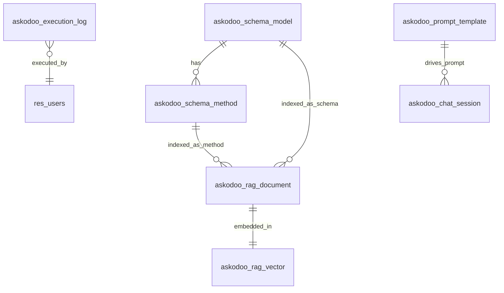
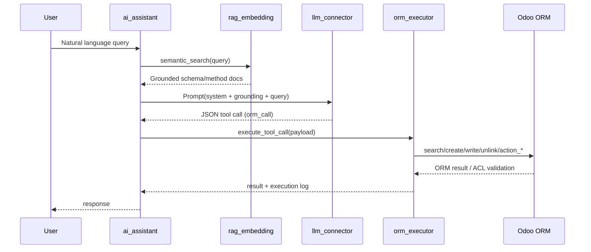

# AskOdoo Architecture

## Database Schema (logical)

```mermaid
erDiagram
    askodoo_schema_model ||--o{ askodoo_schema_method : has
    askodoo_schema_model ||--o{ askodoo_rag_document : indexed_as_schema
    askodoo_schema_method ||--o{ askodoo_rag_document : indexed_as_method
    askodoo_rag_document ||--|| askodoo_rag_vector : embedded_in
    askodoo_execution_log }o--|| res_users : executed_by
    askodoo_prompt_template ||--o{ askodoo_chat_session : drives_prompt
```

## Sequence Flow (RAG + ORM execution)

```mermaid
sequenceDiagram
    participant U as User
    participant API as ai_assistant
    participant RAG as rag_embedding
    participant LLM as llm_connector
    participant EXEC as orm_executor
    participant DB as Odoo ORM

    U->>API: Natural language query
    API->>RAG: semantic_search(query)
    RAG-->>API: Grounded schema/method docs
    API->>LLM: Prompt(system + grounding + query)
    LLM-->>API: JSON tool call (orm_call)
    API->>EXEC: execute_tool_call(payload)
    EXEC->>DB: search/create/write/unlink/action_*
    DB-->>EXEC: ORM result / ACL validation
    EXEC-->>API: result + execution log
    API-->>U: response
```
